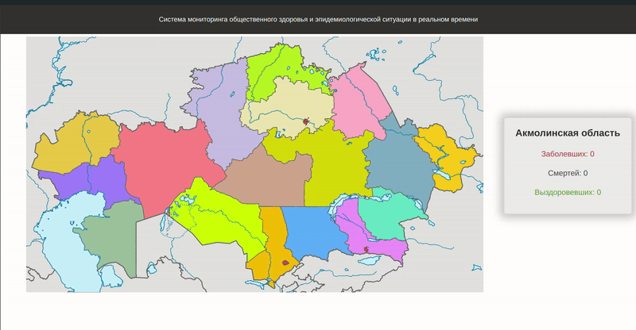

# About

This is a simple Go application that highlights regions of Kazakhstan on a map. When you click on a specific region, you will see information about the health status of its population (infected, deceased, recovered). The application uses SQLite for the database.

**Features**
- Interactive map with clickable regions.
- Displays health statistics for each region.
- Utilizes SQLite for data storage.



## Prerequisites

- Go 1.21 or later installed. You can download it from [golang.org](https://golang.org/dl/).

## Getting Started

1. **Clone the repository:**

    ```sh
    git clone https://github.com/Gontafi/health_map_kazakhstan
    cd health_map_kazakhstan
    ```

2. **Build and run the application:**

    ```sh
    go run main.go
    ```
